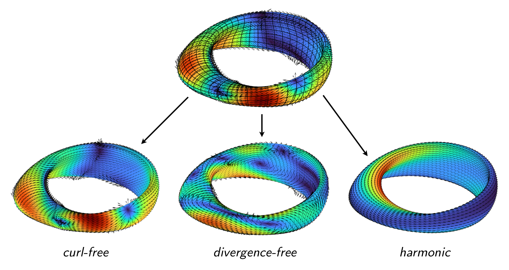

Hodge decomposition
===================

The Laplace--Beltrami problem arises when computing the Hodge decomposition of
tangential vector fields. For a vector field :math:`\boldsymbol{f}` tangent to
the surface :math:`\Gamma`, the Hodge decomposition writes
:math:`\boldsymbol{f}` as the sum of curl-free, divergence-free, and harmonic
components,

.. math::

    \boldsymbol{f} = \underbrace{\nabla_\Gamma u}_{\text{curl-free}} + \underbrace{\boldsymbol{n} \times \nabla_\Gamma v}_{\text{divergence-free}} + \underbrace{\boldsymbol{w}}_{\text{harmonic}}\hspace{-0.15cm},

where :math:`u` and :math:`v` are scalar functions on :math:`\Gamma` and
:math:`w` is a harmonic vector field, i.e.,

.. math::

    \nabla_\Gamma \cdot \boldsymbol{w} = 0, \qquad \nabla_\Gamma \cdot (\boldsymbol{n} \times \boldsymbol{w}) = 0.

Such vector fields play an important role in integral-equation-based methods for
computational electromagnetics. To numerically compute such a decomposition, one
may solve two Laplace--Beltrami problems for :math:`u` and :math:`v`,

.. math::
    
    \Delta_\Gamma u =  \nabla_\Gamma \cdot \boldsymbol{f} \quad \text{ and } \quad
    \Delta_\Gamma v = -\nabla_\Gamma \cdot \left( \boldsymbol{n} \times \boldsymbol{f} \right),

and then set :math:`\boldsymbol{w} = \boldsymbol{f} - \nabla_\Gamma u - \boldsymbol{n} \times \nabla_\Gamma v`.

.. code-block:: matlab

    % Construct a toroidal mesh
    p = 16; nu = 16; nv = 48;
    dom = surfacemesh.torus(p+1, nu, nv);

    % Make a random smooth tangential vector field
    rng(0)
    gx = randnfun3(10, boundingbox(dom));
    gy = randnfun3(10, boundingbox(dom));
    gz = randnfun3(10, boundingbox(dom));
    g = cross([0 1 1], surfacefunv(@(x,y,z) gx(x,y,z), ...
                                @(x,y,z) gy(x,y,z), ...
                                @(x,y,z) gz(x,y,z), dom));
    vn = normal(dom);
    f = -cross(vn, vn, g);

    % Compute the Hodge decomposition
    tic
    [u, v, w] = hodge(f);
    toc

.. container:: output-text

    .. raw:: html

        <pre style="line-height: 1.4;">
        Elapsed time is 3.928942 seconds.
        </pre>

The resulting fields are plotted below.

Let's check how numerically harmonic the resulting :math:`\boldsymbol{w}` field
is:

.. code-block:: matlab

    norm(div(w))

.. container:: output-text

    .. raw:: html

        <pre style="line-height: 1.4;">
        ans =

             1.487419678183640e-07
        </pre>

.. code-block:: matlab

    norm(div(cross(vn, w)))

.. container:: output-text

    .. raw:: html

        <pre style="line-height: 1.4;">
        ans =

             7.080441291347141e-07
        </pre>