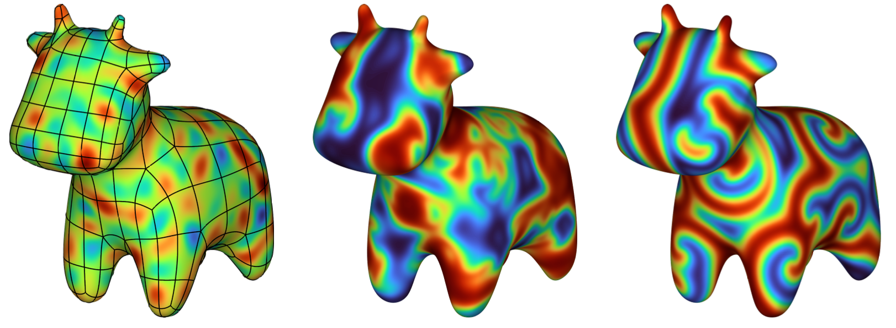
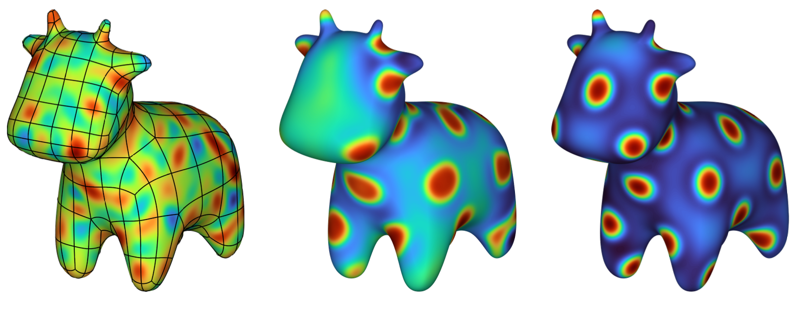

Time-dependent reaction--diffusion
==================================

Consider a nonlinear time-dependent PDE of the form

.. math::

    \frac{\partial u}{\partial t} = \mathcal{L}_\Gamma u + \mathcal{N}(u),

with :math:`\mathcal{L}_\Gamma` a linear surface differential operator and
:math:`\mathcal{N}` a nonlinear, non-differential operator. Such PDEs appear as
models for reaction--diffusion systems, where :math:`\mathcal{L}_\Gamma`
contains the diffusion terms and :math:`\mathcal{N}` the reaction terms. As the
timescales of diffusion and reaction are often orders of magnitude different,
explicit timestepping schemes can suffer from a severe time step restriction.
Implicit or semi-implicit timestepping schemes can alleviate stability issues,
e.g., by treating the diffusion term :math:`\mathcal{L}_\Gamma` implicitly.

Fix a time step :math:`\Delta t > 0`. Discretizing in time with a simple
backward Euler scheme results in a steady-state PDE at each time step of the
form

.. math::

    (I - \Delta t \mathcal{L}_\Gamma) u^{k+1} = u^k + \Delta t \mathcal{N}(u^k)

If the operator :math:`\mathcal{L}_\Gamma` is time-independent, then a solver
for this PDE may be constructed once and reused at each time step with a
different righthand side. We'll construct a ``surfaceop`` which does just that.

Complex Ginzburg--Landau equation
---------------------------------

The complex Ginzburg--Landau equation on a surface :math:`\Gamma` is given by

.. math::

    \frac{\partial u}{\partial t} = \delta (1+\alpha i) \Delta_\Gamma u + u - (1+\beta i) u \lvert u \rvert^2,

where :math:`u = u(\boldsymbol{x}, t) \in \mathbb{C}` and :math:`\alpha`,
:math:`\beta`, and :math:`\delta` are parameters.

.. code-block:: matlab

    % Set parameters
    dt = 0.03;
    tend = 60;
    alpha = 0;
    beta = 1.5;
    delta = 5e-4;

    % Define nonlinear operator
    N = @(u) u - (1+beta*1i)*u.*(abs(u).^2);

    % Import the cow mesh
    dom = surfacemesh.fromRhino('models/cow.csv', 8);

    % Construct linear solver
    pdo = struct('lap', -dt*delta*(1+alpha*1i), 'c', 1);
    L = surfaceop(dom, pdo);
    L.build()

    % Initial conditions
    rng(1)
    f = randnfun3(0.2, boundingbox(dom));
    u = surfacefun(@(x,y,z) f(x,y,z), dom);

    % Simulate
    t = 0;
    kend = floor(tend/dt);
    for k = 1:kend
        tic
        L.rhs = u + dt*N(u);
        u = L.solve();
        toc
        t = t + dt;
        if ( mod(k, 10) == 0 )
            fprintf('k = %d\n', k);
            clf, plot(real(u)), drawnow
        end
    end

Snapshots of the simulation at :math:`t=0`, :math:`t=6`, and :math:`t=60` are
shown below.

Turing system
-------------

Consider the two-species reaction--diffusion system on a surface :math:`\Gamma$`
given by,

.. math::

    \begin{aligned}
    \frac{\partial u}{\partial t} &= \delta_u \Delta_\Gamma u + \alpha u \left(1-\tau_1 v^2\right) + v \left(1-\tau_2 u\right), \\
    \frac{\partial v}{\partial t} &= \delta_v \Delta_\Gamma v + \beta v \left(1 + \frac{\alpha \tau_1}{\beta} u v \right) + u \left(\gamma + \tau_2 v\right).
    \end{aligned}

Solutions :math:`u` and :math:`v` to this system can exhibit Turing
patterns---namely, spots and stripes---depending on the choice of parameters
:math:`\delta_u`, :math:`\delta_v`, :math:`\alpha`, :math:`\beta`,
:math:`\gamma`, :math:`\tau_1`, and :math:`\tau_2`.

.. code-block:: matlab

    % Set parameters
    dt = 0.1;
    tend = 200;
    delta_v = 1e-3;
    delta_u = 0.516*delta_v;
    alpha = 0.899;
    beta = -0.91;
    gamma = -0.899;
    tau1 = 0.02;
    tau2 = 0.2;

    % Define nonlinear operators
    Nu = @(u,v) alpha*u.*(1-tau1*v.^2) + v.*(1-tau2*u);
    Nv = @(u,v) beta*v.*(1+alpha/beta*tau1*u.*v) + u.*(gamma+tau2*v);

    % Import the cow mesh
    dom = surfacemesh.fromRhino('models/cow.csv', 8);

    % Construct linear solvers
    pdo = struct('lap', -dt*delta_u, 'b', 1);
    Lu = surfaceop(dom, pdo);
    Lu.build();
    pdo = struct('lap', -dt*delta_v, 'b', 1);
    Lv = surfaceop(dom, pdo);
    Lv.build();

    % Initial conditions
    rng(1)
    bb = boundingbox(dom);
    f = randnfun3(0.2, bb);
    u = surfacefun(@(x,y,z) f(x,y,z), dom);
    f = randnfun3(0.2, bb);
    v = surfacefun(@(x,y,z) f(x,y,z), dom);

    % Simulate
    t = 0;
    kend = floor(tend/dt);
    for k = 1:kend
        Lu.rhs = u + dt*Nu(u,v);
        Lv.rhs = v + dt*Nv(u,v);
        u = Lu.solve();
        v = Lv.solve();
        t = t + dt;
        if ( mod(k, 100) == 0 )
            fprintf('k = %d\n', k);
            clf, plot(u), drawnow
        end
    end

Snapshots of the simulation at :math:`t=0`, :math:`t=20`, and :math:`t=200` are
shown below.

