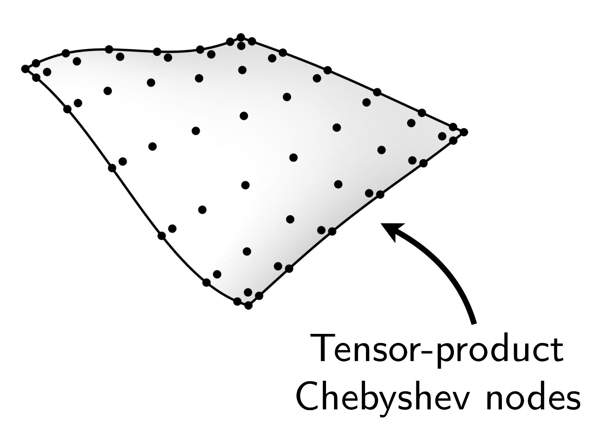
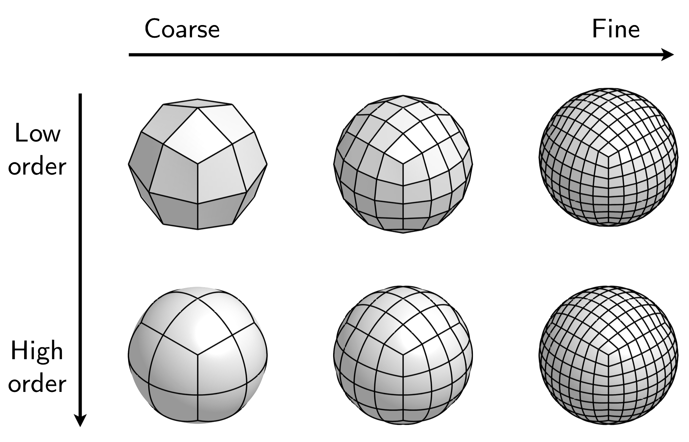

Meshes
======

Before we can compute with functions and solve differential equations on
surfaces, we have to define the surface itself. The ``surfacemesh`` class
encapsulates the definition of the geometry.

A ``surfacemesh`` consists of a collection of high-order quadrilateral *patches*
whose union define the geometry. We choose to represent all patches of the
surface with respect to their embedding space---the three-dimensional Cartesian
coordinate system :math:`(x,y,z)`:

.. figure:: images/mapping.png
   :width: 650px
   :align: center

Derived quantities such as metric tensor information and Jacobian factors are
automatically computed and abstracted away from the user.

Surface representation
----------------------

Each patch of a ``surfacemesh`` is represented using a set of high-order
nodes---specifically tensor-product Chebyshev nodes.

Let's construct the set of tensor-product Chebyshev nodes in :math:`[-1,1]^2`
and plot them:

.. code-block:: matlab

    n = 16;
    [u, v] = chebpts2(n);
    plot(u, v, 'ko', markerfacecolor='k')
    axis equal off

.. container:: output-image

    .. figure:: images/chebyshev.png
        :width: 200px
        :align: center

Now let's create a surface mesh with a single patch using these nodes. The
constructor takes as input the coordinates of the nodes on each patch as a
MATLAB cell array whose length is equal to the number of patches in the mesh:

.. code-block:: matlab

    x = u;
    y = v;
    z = cos(u).*cos(v);
    dom = surfacemesh({x}, {y}, {z});
    plot(dom), camlight

.. container:: output-image

    .. figure:: images/single_element.png
        :width: 400px
        :align: center

We can verify that the mesh has a single element by asking for the length of the
mesh:

.. code-block:: matlab

    length(dom)

.. container:: output-text

    .. raw:: html

        <pre style="line-height: 1.4;">
        ans =

             1
        </pre>

Now let's make a surface consisting of a few elements arranged in a 4 x 4 grid
and map them to the graph of a given function.

.. code-block:: matlab

    mx = 4;
    my = 4;

    x = cell(mx*my, 1);
    y = cell(mx*my, 1);
    z = cell(mx*my, 1);

    % Create a random function to define the surface
    rng(0)
    f = 0.2*randnfun2;

    k = 1;
    for i = 1:mx
        for j = 1:my
            % Map the Chebyshev nodes to smaller squares inside [-1,1]^2
            % and evaluate the given function
            uk = (u+1)/mx + 2/mx*(i-1) - 1;
            vk = (v+1)/my + 2/my*(j-1) - 1;
            x{k} = uk;
            y{k} = f(uk,vk);
            z{k} = vk;
            k = k+1;
        end
    end

    % Construct the surfacemesh
    dom = surfacemesh(x, y, z);

    plot(dom), camlight

.. container:: output-image

    .. figure:: images/4x4.png
        :width: 300px
        :align: center

The mesh now has multiple patches:

.. code-block:: matlab

    length(dom)

.. container:: output-text

    .. raw:: html

        <pre style="line-height: 1.4;">
        ans =

             16
        </pre>

Built-in surfaces
-----------------

The ``surfacemesh`` class provides a number of built-in surface generation tools
for creating simple surfaces. We'll start by creating a "cubed sphere" mesh,
which consists of a cube mesh that has been inflated to live on the sphere:

.. code-block:: matlab

    % Create a sphere mesh of order p with two levels of refinement:
    p = 16;
    nref = 2;
    dom = surfacemesh.sphere(p+1, nref);
    plot(dom), camlight

.. container:: output-image

    .. figure:: images/sphere.png
        :width: 300px
        :align: center

We can deform this mesh in various ways. For instance, we can create a blob-like
surface mesh by radially perturbed the nodes of the spherical mesh according to
a random smooth function. This is encapsulated in the ``surfacemesh.blob``
routine:

.. code-block:: matlab

    % Create a sphere mesh of order p with two levels of refinement:
    rng(0)
    dom = surfacemesh.blob(p+1, nref);
    plot(dom), camlight

.. container:: output-image

    .. figure:: images/blob.png
        :width: 300px
        :align: center

If we keep calling this function, we'll generate new surfaces due to the
randomness of the algorithm:

.. code-block:: matlab

    rng(0)
    for k = 1:3
        dom = surfacemesh.blob(p+1, nref);
        figure, plot(dom), camlight
    end

.. container:: output-image

    .. figure:: images/blobs.png
        :width: 650px
        :align: center

Surface meshes of any genus are supported. Here is a smoothly deformed torus:

.. code-block:: matlab

    p = 16; nu = 8; nv = 24;
    dom = surfacemesh.torus(p+1, nu, nv);
    plot(dom), camlight

.. container:: output-image

    .. figure:: images/torus.png
        :width: 400px
        :align: center

The mesh does not even have to be smooth between patches...

.. code-block:: matlab

    p = 16; nu = 4; nv = 32;
    dom = surfacemesh.twisted_torus(p+1, nu, nv);
    plot(dom), camlight

.. container:: output-image

    .. figure:: images/twisted_torus.png
        :width: 400px
        :align: center

...or even orientable!

.. code-block:: matlab

    p = 16; nu = 30; nv = 7;
    dom = surfacemesh.mobius(p+1, nu, nv);
    plot(dom), camlight

.. container:: output-image

    .. figure:: images/mobius.png
        :width: 400px
        :align: center

Importing an existing mesh
--------------------------

CAD packages such as `Gmsh <https://gmsh.info/>`_ or
`Rhino <https://www.rhino3d.com/>`_ can be used to create a high-order smooth
quadrilateral mesh. Surfacefun supports importing meshes from these packages:

.. code-block:: matlab

    dom = surfacemesh.import('models/cow.csv', 'rhino');
    plot(dom)
    view(180, -85)
    camorbit(20, 0, 'data', 'y')
    camorbit(10, 0, 'data', 'x')
    camorbit(-3, 0, 'data', 'z')
    camlight

.. container:: output-image

    .. figure:: images/cow2.png
        :width: 230px
        :align: center

Convenient ``surfacemesh`` routines
-----------------------------------

Visualizing a mesh
~~~~~~~~~~~~~~~~~~

- Only plot the wireframe of the , not the underlying surface:

  .. code-block:: matlab

    plot(dom, surface='off')

  .. container:: output-image

    .. figure:: images/wireframe.png
        :width: 300px
        :align: center

- Make a mesh plot of the high-order nodes on each patch:

  .. code-block:: matlab

    mesh(dom)

  .. container:: output-image

    .. figure:: images/mesh.png
        :width: 300px
        :align: center

Querying a mesh
~~~~~~~~~~~~~~~

- The number of patches in the ``surfacemesh``:

  .. code-block:: matlab

    length(dom)

  .. container:: output-text

    .. raw:: html

        <pre style="line-height: 1.4;">
        ans =

             96
        </pre>

- The polynomial order of each patch:

  .. code-block:: matlab

    order(dom)

  .. container:: output-text

    .. raw:: html

        <pre style="line-height: 1.4;">
        ans =

             16
        </pre>

- The total number of degrees of freedom in the ``surfacemesh``:

  .. code-block:: matlab

    numel(dom)

  .. container:: output-text

    .. raw:: html

        <pre style="line-height: 1.4;">
        ans =

             27744
        </pre>

- The volume enclosed by a closed ``surfacemesh``:

  .. code-block:: matlab

    volume(dom) - 4/3*pi

  .. container:: output-text

    .. raw:: html

        <pre style="line-height: 1.4;">
        ans =

            -3.552713678800501e-15
        </pre>

- The surface area of the ``surfacemesh``:

  .. code-block:: matlab

    surfacearea(dom) - 4*pi

  .. container:: output-text

    .. raw:: html

        <pre style="line-height: 1.4;">
        ans =

            -3.552713678800501e-15
        </pre>

- The smallest box :math:`[x_\text{min}, x_\text{max}] \times [y_\text{min}, y_\text{max}] \times [z_\text{min}, z_\text{max}]`
  that contains the ``surfacemesh``:

  .. code-block:: matlab

    boundingbox(dom)

  .. container:: output-text

    .. raw:: html

        <pre style="line-height: 1.4;">
        ans =

            -1     1    -1     1    -1     1
        </pre>

Modifying a mesh
~~~~~~~~~~~~~~~~

A mesh may modified by changing the polynomial degree used to represent each
patch ("p-refinement") or by the changing the number of patches
("h-refinement").

- Change the order of mesh by resampling to a new set of nodes. Let's resample
  the mesh to use 3 nodes per patch:

  .. code-block:: matlab

    dom2 = resample(dom, 3);
    plot(dom2)

  .. container:: output-image

    .. figure:: images/resample.png
        :width: 300px
        :align: center

- Now refine the mesh by dividing each patch into four:

  .. code-block:: matlab

    dom3 = refine(dom2);
    plot(dom3)

  .. container:: output-image

    .. figure:: images/refine.png
        :width: 300px
        :align: center
